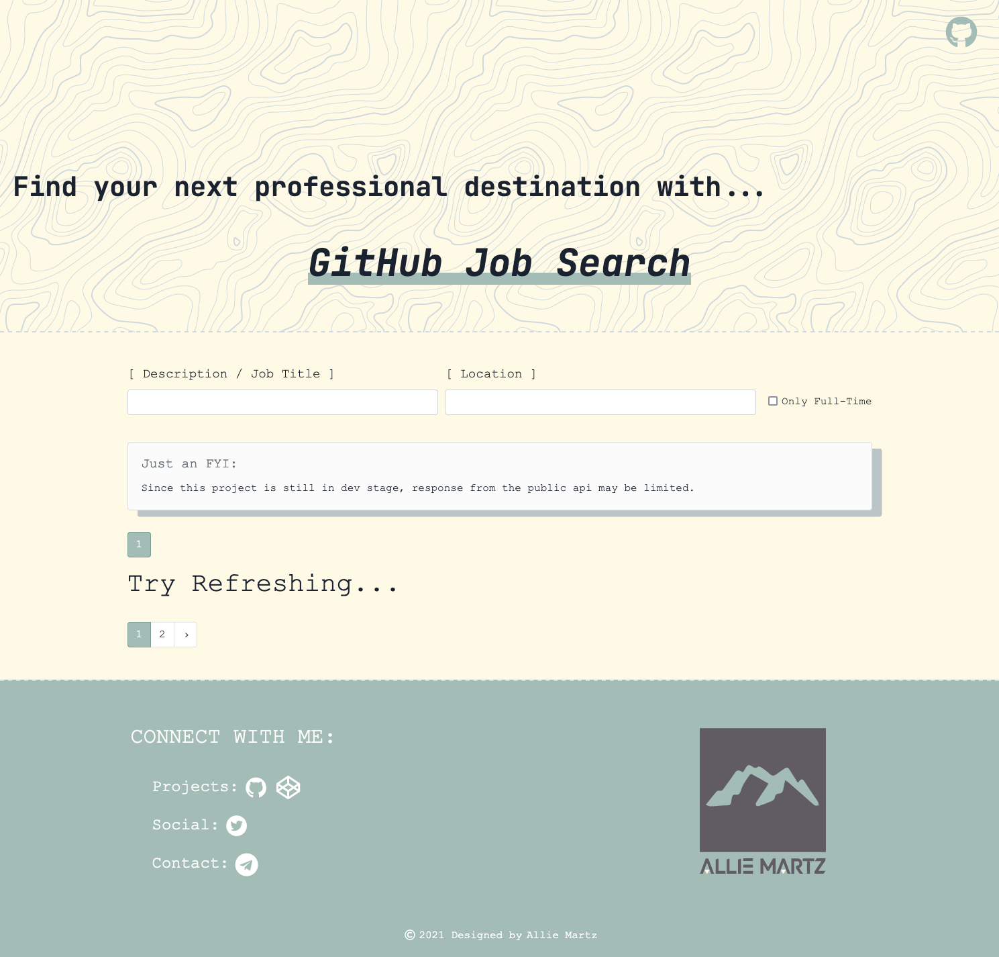

# GitHub Job Search

Created to interact with the Github Jobs API. You can search for a job position using a form with three fields: description, location, and whether the jobs must be full time only.

## Run the app

First download or clone this repository. To run this app, you will need to have `Node.js` and `npm` on your machine. If you don't, you can install them using `NVM`. Before running the app for the first time, you will need to install the required packages. In order to do this, go to the root folder of the project and run `npm install`. Once you have installed the dependencies, you can run the app by running npm start. This will start a proxy server on localhost:3001 and will load the React app on localhost:3000. When the start scripts have finished, you may visit localhost:3000 in a web browser to see the app.

## Tech Used 

- GitHub API
- React Bootstrap for basic component foundation
- Mixed in Styled Components for the footer section to see what it was about. 
- ScrollUp 
- React-Reveal 

## Features to add:

- [ ] A save function so users can easily view jobs they are interested in.